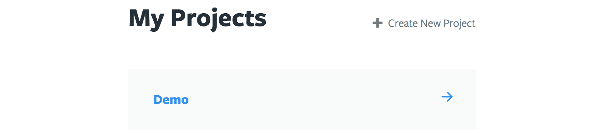
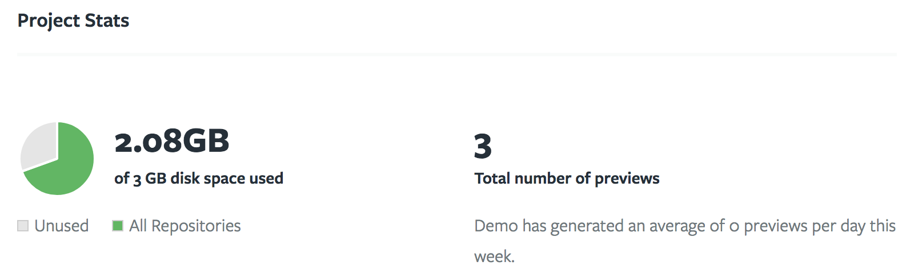

# Projects

A Tugboat Project is tied to a subscription model (free or premium), and can
contain any number of repositories. Other Tugboat users can be invited to share
a Tugboat Project. All Repositories added to a Tugboat Project share the disk
quota tied to its subscription.

## Listing Your Projects

If you have only one Project, the home page will show that project's dashboard.
If you have multiple Projects, the home page will show you a list of all
Projects you either own or have permission to view.

## Adding a Project

If you do not have any Projects, you will be presented with a form to create a
Project when you log in. If you already have one or more Projects, you can
create a new Project from the My Projects page. Navigate to this page either via
the breadcrumbs or via the My Projects links in the user dropdown menu in the
main navigation.

## Project Dashboard

The project dashboard is where you can manage a project's repositories, see
usage statistics, and access its settings.

## Project Settings

[Project Settings](settings/index.md) can be accessed from the Project
Dashboard.

