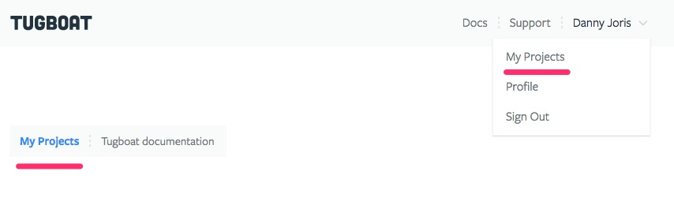
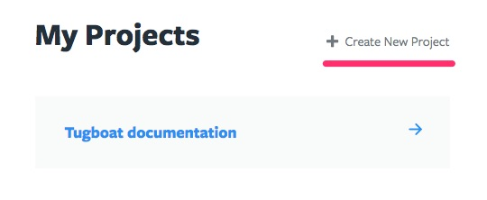

# Projects

This chapter will guide you through the Project dashboard and settings.

* [Dashboard](dashboard/index.md)
* [Settings](settings/index.md)

## Intro

A Tugboat Project can contain any amount of repositories you want Tugboat to build previews for, and is tied to a subscription model (free or premium). Additionally, you can invite users to join the project. You can create as many projects as you like. All Repositories added to a Project will share the disk quota tied to its subscription.

## Listing Your Projects

If you have only one Project, the home page will show that project's dashboard. If you have multiple Project the home page will show you the My Projects page, which lists all Projects you either own or are invited to.

## Adding a Project

When you sign in to Tugboat for the first time, and you haven't been invited to a project you will be served a Project creation form. When you already have one or more Projects, you can create a new Project from the My Projects page. You can navigate to My Projects either via the breadcrumbs or via the My Projects link in the user's dropdown menu in the main navigation.

