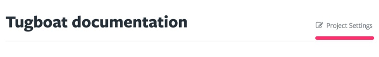
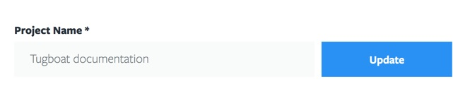
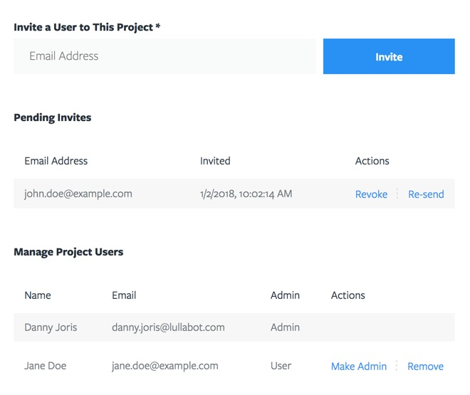
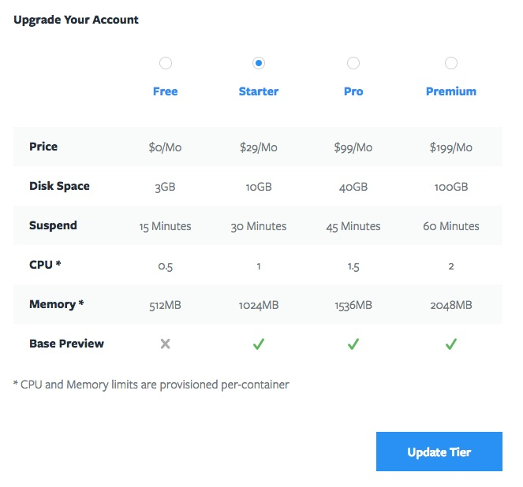
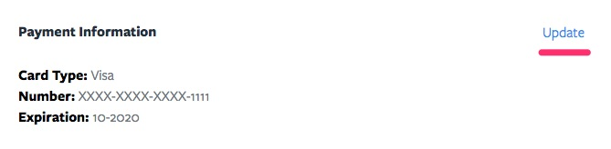
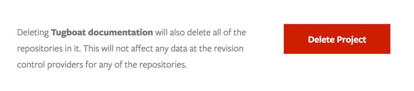

# Project Settings

From the Project Dashboard navigate to the Project Settings via the link next to the Project title.

## Project Name

Updating the Project name is very straightforward and can be done at any time.

## User Management

If you are an admin of a project you have the ability to invite and manage users. If you created the project, you will have admin status. Simply fill out the user's email address and they will receive an email with an invitation link. Note that the email address doesn't have to match any of the user's provider accounts. The user receives the email and then logs into Tugboat with one of their provider sign-in's. This is why in the user list the email address of the newly invited user may be different than the one you used to invite them.

When a user has accepted their invitation, you can make them an admin or revoke access.

Admins have access to manage the full Project settings and have permissions to add new Repositories.

## Manage Subscription

You may find yourself in a position where works ramps up and your disk space quota fills up fast. This is a good time to upgrade your subscription, which you can do so here in the Project settings. Check out the tier table for details.

- **Price:** All prices are in USD.
- **Disk Space:** Disk Space is shared across all Repositories you may have set up in your project. An efficient way of reducing disk space is to use Base Previews, which is available in any of the premium subscriptions.
- **Suspend:** This is the time until a Preview gets moved to a "suspended" state after inactivity. Suspended Previews will automatically start up once the URL is hit again.
- **CPU:** How much CPU is provisioned per service
- **Memory:** How much memory is provisioned per service
- **Base Preview:** Premium subscriptions have the ability to create Base Previews. The 2 main advantages of Base Previews are significant *build speed improvements* and *less disk space* usage. The way Base Previews work is that you designate one (or more) preview(s) to be a Base Preview. Often this is a `dev` or `master` branch. Any other Previews built when there is a Base Preview available will be built based off of the Base Preview.
  - **Improved build speed:** because a new Preview will just be a copy of the Base Preview with just the difference applied, builds will be signficantly faster.
  - **Less disk space:** the size of a new Preview will only be the difference between the Base Preview and the new Preview. The difference will be at least around 400MB which is the size of the server.

### Tier Upgrade

If you upgrade from a free to any of the premium subscriptions you will be presented with the monthly cost and a form to fill out your credit card information.

If you upgrade from a premium subscription you will be presented with a confirmation page detailing the changes to your plan. You will be charged a prorated amount of the new subscription for the remainder of the current billing cycle and you will be refunded the remaining amount for the month of your previous subscription. In the next billing cycle you will be charged the full amount of your new subscription.

For example if you are _exactly_ in the middle of your billing cycle and you upgrade from a $29/month plan to a $99/month plan, you will be charged the difference between $49.5 (remainder of the cycle for the $99/mo plan) and refunded $14.5 (remainder of the cycle for the $29/mo plan). Note that this is calculated very accurately and can vary by the minute (albeit only by a cent or so every couple minutes).

### Tier Downgrade

Downgrading a tier will take effect after the current billing cycle. So for the remainder of the current billing cycle you keep your current subscription. A pending downgrade can always be undone by updating to the current or higher tier.

### Credit Card Details

Once you filled out your credit card information for a premium subscription, you can update your credit card information later at any time.

## Delete Project

Deleting a Project cannot be undone. When you delete a Project the following will happen:

- The Project and all containing Repositories, Previews and settings will be removed. The actual code repositories from the providers will remain untouched.
- The subscription will be cancelled. There will be no refund for the remaining balance.

If you want to shut down all activity of the Project, but want to keep it around you can downgrade it to a free tier, so you can upgrade it to a premium subscription at any time later and start off where you left it.

