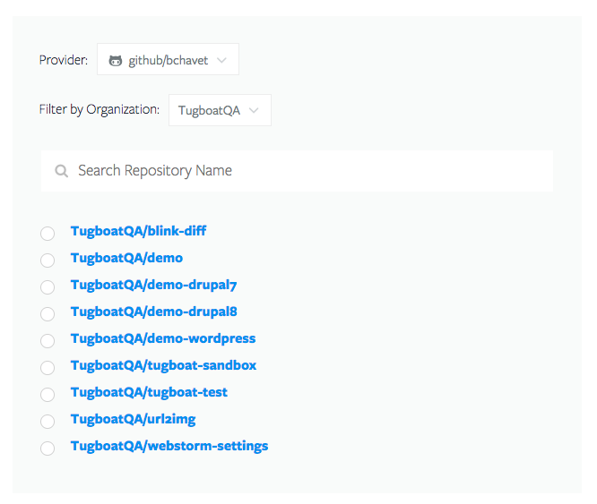

# Repositories

A Tugboat Repository is tied to a Git repository at one of the available git
providers. A repository can contain any number of previews serving the site in
the repository.

## Listing Your Repositories

Repositories are grouped by [Project](../projects/index.md). To see a list of
repositories in the same project, visit that project's dashboard.

## Adding a Repository

Repositories are added from a Project's dashboard. Any number of repositories
can be added to a project. A list of repositories available to you from your
authenticated git provider accounts is provided to select from. Additional
provider accounts can be linked to your tugboat account from your [user
profile](../profile).

## Repository Dashboard

The repository dashboard is where you can manage that repositories previews, see
usage statistics, and access its settings.

### Latest Previews

### Base Previews

### Previews Available to Build

## Repository Services

## Repository Settings

## Remote SSH Access

## Deleting a Repository