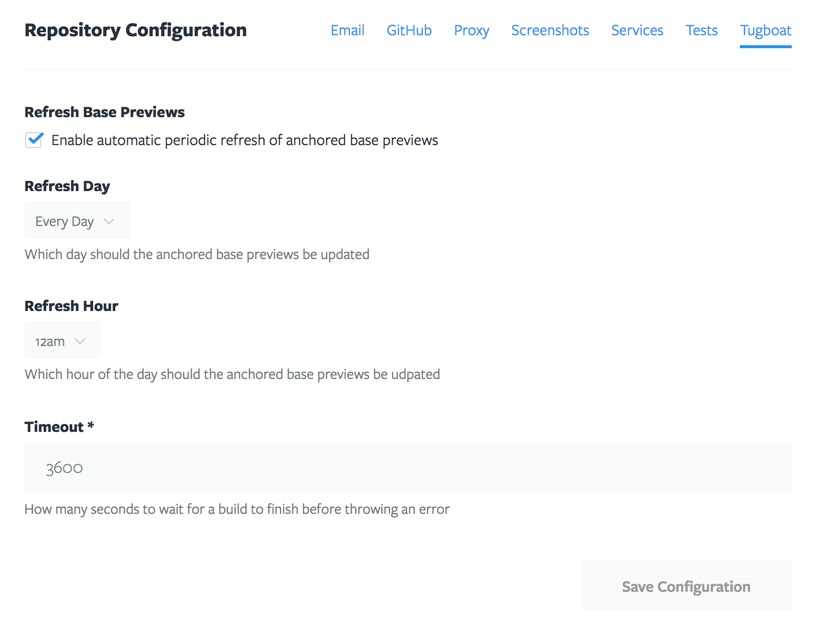
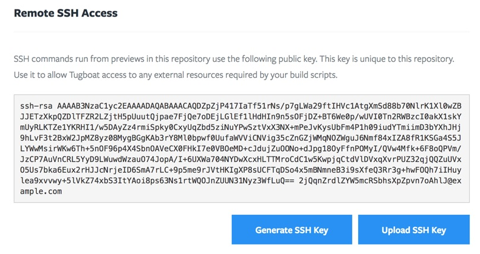
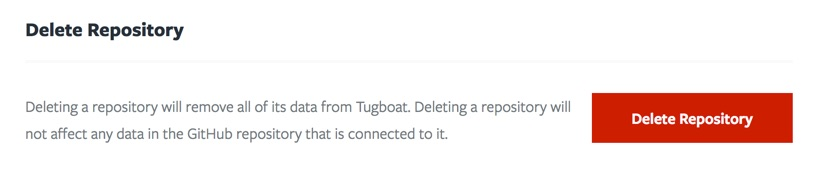

# Repository Settings

## Services

Services act like isolated servers that run a specific part of your application
stack, such as a web server, database, cache engine, etc. While you can install
any applications that you need from a [build script](../build-scriopt/index.md),
we highly recommend using Services whenever available as they're easy to include
and most importantly, they have their own designated CPU(s) and memory.

The Service which will serve your application should be asigned as the
"webhead". In most cases this will be a web server like Apache.

Services can be given a custom name, but in most cases the default will work
fine. Whatever name is given to a Service is the network name that it can be
accessed with. Every preview is given its own set of these services in an
isolated network.

If you need a service that is not yet listed, you can always create your own by
selecting one of the existing options, `ubuntu` probably being the best one to
use, and customize it with a [Build Script](../../build-script/index.md).

We are also happy to work with you to create a service that may be useful to
other customers.  Contact us at [support@tugboat.qa](mailto:support@tugboat.qa)
for more information, or submit a pull request against
[Lullabot/tugboat-registry](https://github.com/Lullabot/tugboat-registry).

**Advanced Service Settings**

In a service's settings, an optional "Ready Command" can be
provided. This command is used by Tugboat to determine when a newly created
service instance is actually ready to be used. For example, sometimes it takes
MySQL a few seconds to initialize before it is ready to accept connections. If
a service has a "Ready Command", Tugboat waits until that command executes
successfully before moving on to the next step of a build.

Be careful with this command. If not configured correctly, a build may never
complete. Tugboat will eventually time out waiting for it to succeed.

## Configuration

The Configuration section of the Repository Settings page is where various
different options can be configured for the repository. These options are
bundled into groups that affect related behavior.

## Remote SSH Access

Tugboat commonly requires access to external resources in order to properly
build a preview. These typically consist of things like databases or a set of
static asset files. These resources need to be accessible somewhere on the
internet in order for Tugboat to be able to import them. This can be
accomplished in a number of different ways, but the recommended method is to
make them accessible over SSH.

Tugboat generates a unique SSH key pair for every repository. It then uses that
key pair by default whenever it makes an outbound SSH connection. The public key
can be found in the Repository Settings page, and should be imported into
whichever system is serving the required assets. You can also provide your own
private key if so desired, or ask Tugboat to generate a new key.

## Delete Repository

A repository can be deleted by any administrator of the project that it belongs
to. This action can not be undone. When a repository is deleted:

* All Previews in the repository are deleted immediately
* All settings for the Repository are lost

Deleting a repository does NOT affect any data at the provider repository that
it is connected to (GitHub, GitLab, Bitbucket, etc)

