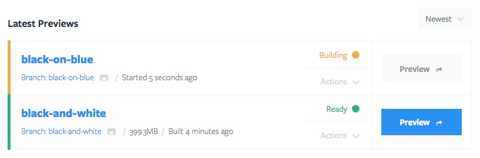
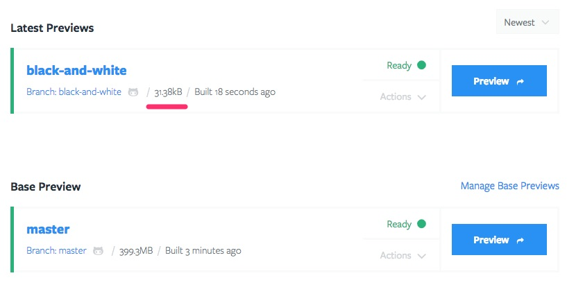

# Repository Dashboard

## Latest Previews

Latest Previews lists all your previews that are either built or in the process of being built. Each Preview in this list includes their title which links to its Preview dashboard, their status, actions, additional build info, and a preview button which opens the live Preview in a new browser tab.

## Base Previews

Premium subscriptions have the ability to create Base Previews. The 2 main advantages of Base Previews are significant *build speed improvements* and *less disk space* usage. The way Base Previews work is that you designate one (or more) preview(s) to be a Base Preview. Often this is a `dev` or `master` branch. Any other Previews built when there is a Base Preview available will be built based off of the Base Preview.
- **Improved build speed:** because a new Preview will just be a copy of the Base Preview with just the difference applied, builds will be signficantly faster.
- **Less disk space:** the size of a new Preview will only be the difference between the Base Preview and the new Preview. The difference will be at least around 400MB which is the size of the server.

First, make sure you have built the preview that you want to be the Base Preview and make sure that it's working correctly. Then, click the "Manage Base Previews" link.

Then, select the Preview.

New Previews will be built based on the Base Preview. You will notice faster build times and smaller Previews.

## Pull Requests, Tags and Branches Available to Build

Here you will find all Pull Requests, Tags, and Branches that are available to be built. Once it is built, it will move up from this list to the Latest Previews section.

## Repository Stats

The Repository stats give some useful insights about the state of your Repository. For one the usage of the current Repository compared to other Repositories in the same Project and the total quota.

